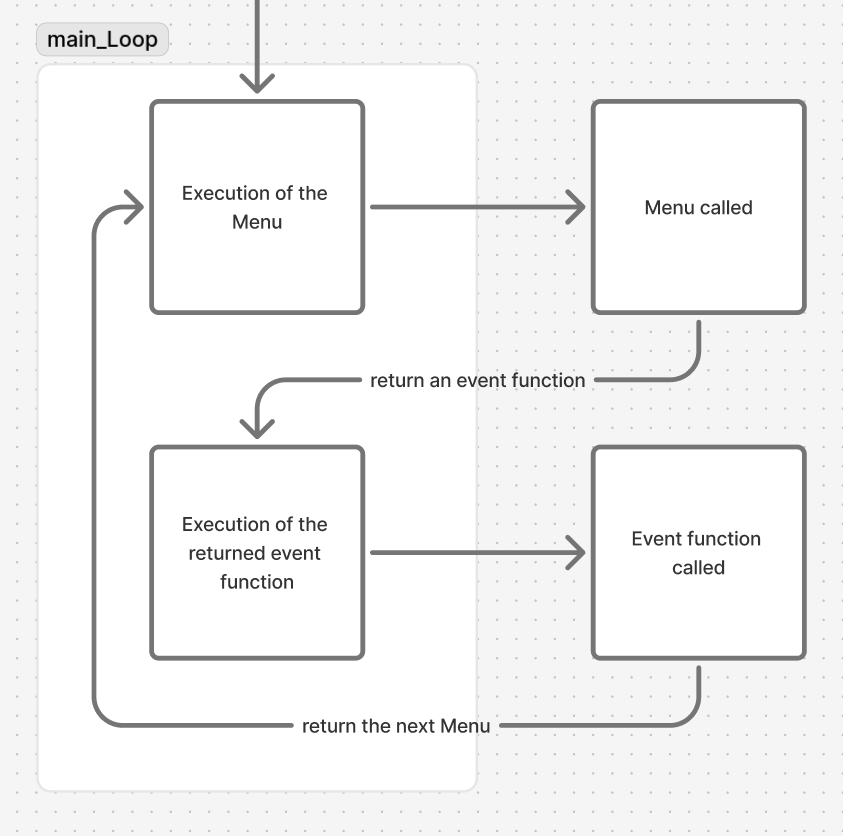

# Main structure:

The game is running in a main class : `Game` and more precisely in the function `main_Loop()`\
This loop execute classes of type `Menu`, thoses menu return a function that the main loop will execute and get the next returned Menu, and will execute this class etc...\


# Menu Class:

### Description:

The game is a succession of `Menu`, the class Menu correspond to a screen that has :
- A context (text to explain the content of the menu)
- Descriptions of the possible options (like : "attack", "use special")
- A list of pointer of functions that is behind the options (ex: `hitplayer`, `use_special`). Let's call thoses functions "event function"

### Event function:

The event function have to be in the Menu where it's used.

All event function can be divide in two step :\
- After-effect of the choice, (ex: add a hp, update stats). This part is optionnal if we just need to change of screen (ex: the function `newGame`)
- An event function must return a `Menu` class or one that hinerit of it. This returned `Menu` will be the next Menu use. If you don't want to change the screen and want to loop on the same screen you just `return self`, `self` refering to the `Menu` currently executed.

#### Event function with arguments:

If your event function need an argument, you have to put it in a lambda function :\
Ex: If the player choose the first option we need to call `take_damage(dmg)`, dmg being a int variable. 

```
def Exemple(Menu) :
    def __init__(self) :
        super().__init__(
            "context",
            [
                "Option 1",
                "Option 2"
            ],
            [
                lambda : take_damage(dmg), # here we want a pointer to a function
                function_op_2
            ]
        )
```

If you don't do that the game will crash.


